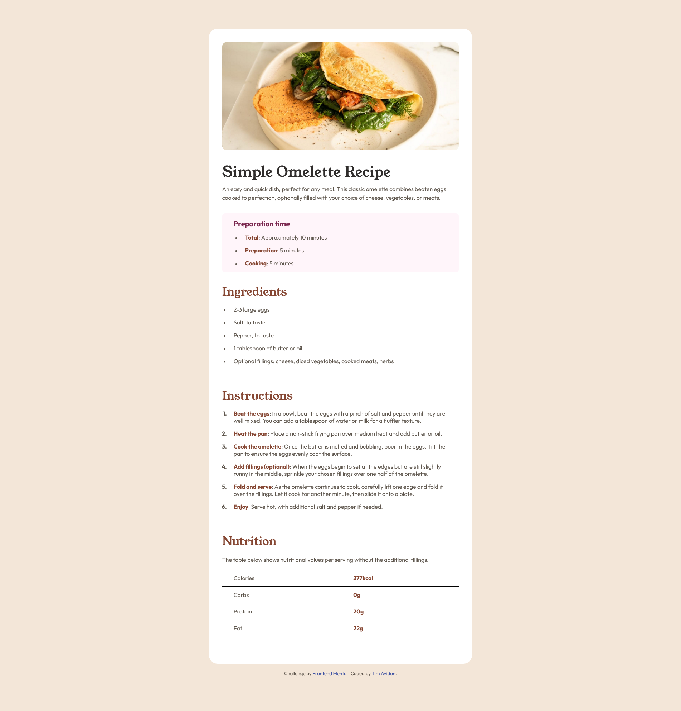

# Frontend Mentor - Recipe page solution

This is a solution to the [Recipe page challenge on Frontend Mentor](https://www.frontendmentor.io/challenges/recipe-page-KiTsR8QQKm). Frontend Mentor challenges help you improve your coding skills by building realistic projects.

## Table of contents

- [Overview](#overview)
  - [The challenge](#the-challenge)
  - [Screenshot](#screenshot)
  - [Links](#links)
- [My process](#my-process)
  - [Built with](#built-with)
- [Author](#author)

## Overview

### Screenshot

### Links

- Solution URL: [Github](https://github.com/timavidon/Recipe-page)
- Live Site URL: [Live Site](https://timavidon.github.io/Recipe-page/)

## My process

### Built with

- Semantic HTML5 markup
- CSS
- Mobile-first workflow

## Author

- Frontend Mentor - [@timavidon](https://www.frontendmentor.io/profile/timavidon)
- X - [@timcode](https://twitter.com/timcode)
